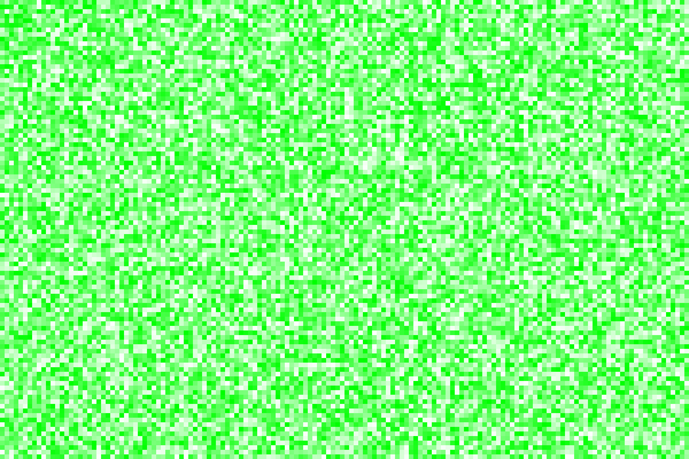
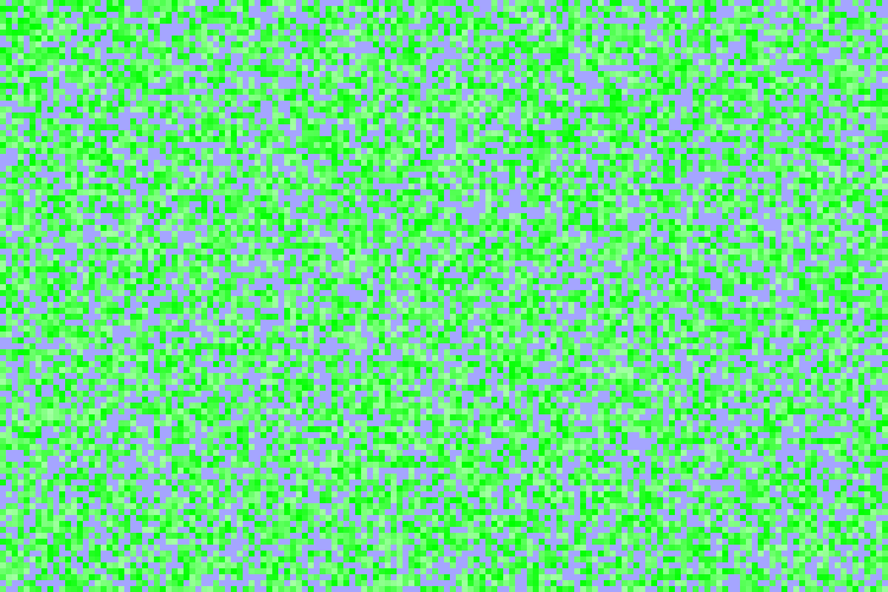
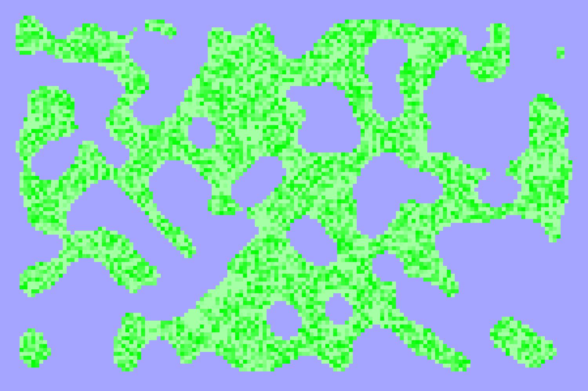
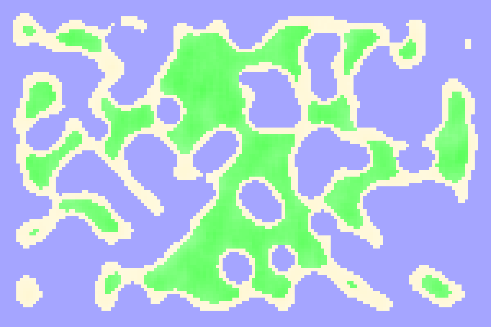

# Procedural Generation
A WIP project to have a go at procedural generation terrain.

Stages:
 - Randomly generate heights of terrain
 
 
 - Flood terrain to provided level
 
 
 - Smooth terrain formation

 
  - Smooth heights
 
 
 - Add beaches
 
 

Plans to output to more formats
